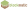

<p align="center">
    <a href="https://blockmatic.trafficlunar.net"></a>
    <br>
    <h3 align="center">Online pixel art editor for Minecraft (with support for images!)</h3>
    <h3 align="center"><a href="https://blockmatic.trafficlunar.net"></a></h3>
</p>

## Development Instructions

Blockmatic uses React, Vite, pnpm, and TypeScript. To get started in development mode, run:

```bash
$ pnpm run dev
```

This will start the development server and send a link in console to Blockmatic.

To build and preview blockmatic for production, run:

```bash
$ pnpm run build
$ pnpm run preview
```

The first command builds the application, and the second one previews it locally.

To somewhat automatically generate data for blockmatic, please refer to the [README.md](generator/README.md) in the `generator` folder.
